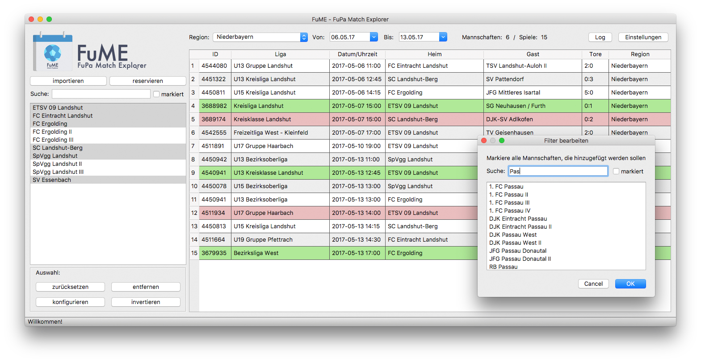
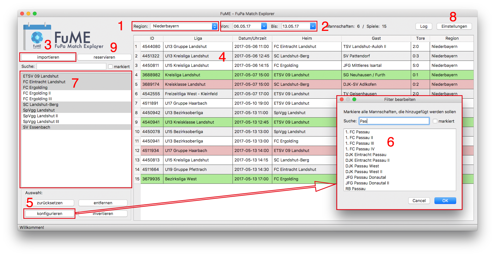

# Was ist FuME?
:us: _Short description in english:_ FuME is the one and only Match Explorer for the German amateur soccer platform [FuPa.net](https://www.fupa.net/index.php?page=kalender) written in pythons qt module pyqt5 published under LGPLv3 license using requests for public website information and selenium for [Vereinsverwaltung](https://www.fupa.net/fupa/admin/index.php) (password required).
 
FuME helps photographers speeding up their workflow by **filtering** all on [FuPa Match-Kalender](https://fupa.net/index.php?page=kalender) listed games by team name, match date and location - all adjustable at once! In FuPa you have to reserve every game you want to photograph (time consuming and annoying) - FuME comes with **bulk mode**  to simplify reservation process.

:de: FuME hilft dir beim **Planen**, **Sortieren** und **Reservieren** von Fußballspielen, damit dir kein Spiel entgeht! Einfach Vereine in FuME auswählen, Spiele importieren und loslegen. Pro Spieltag beschäftigst du dich **maximal 5 Minuten** mit suchen und reservieren von duzenden Spielen und behältst somit 20+ Vereine in deiner Region im Blick. Solltest du an der Grenze zweier Regionen wohnen, hilft dir FuME dabei, den Überblick zu behalten. Unübersichtliche, lange und nach Verein beschränkte Listen gehören so der Vergangenheit an. 

## Wer kann FuME nutzen?
Jeder :tada:. Das Projekt ist Open Source und steht allen kostenlos zur Verfügung.

## Features
- individuell einstellbare **Filter** für Mannschaften, Spieltage und FuPa-Regionen
- **multiregonaler** Support
- Spiele **vor allen anderen** direkt in FuME **reservieren** (keine 14 Tage Begrenzung)
- und vieles mehr!

## Download
Aktuell in Version 1.0 (21.06.2017) [(aktuelle Änderungen)](CHANGELOG.md)

### Windows
- [FuME Zip-Datei für Windows von hier downloaden]()
- FuME.zip entpacken und an gewünschtem Ort speichern
- FuME.exe starten

**Anmerkung:** nur Windows 7 und neuer wird unterstützt.

### macOS
- [FuME Zip-Datei für macOS von hier downloaden](releases/download/v1.0/FuME_macOS.zip)
- FuME.zip entpacken und an gewünschtem Ort speichern
- Rechtsklick auf FuME.app -> Öffnen
- klicke öffnen falls eine Sicherheitswarnung erscheint

**Anmerkung:** nur unter macOS Version 10.12 (Sierra) getestet. Ältere Versionen werden nicht zwingend unterstüzt.

## Erster Start

Wähle zuerst deine Region im Dropdown-Menü _(1)_. Beschränke dann den Zeitraum (von/bis), für den die Spiele **angezeigt** 
und **importiert** werden sollen _(2)_. Neue Spiele fügst du nun mit dem Knopf "importieren" _(3)_ der Übersicht hinzu _(4)_. Im Anschluss fügst du deine Vereine, die du fotografierst, über Auswahl "konfigurieren" _(5)_ deiner Vereinsliste _(7)_ hinzu. Im Dialog "Filter bearbeiten" _(6)_ markierst du deine Vereine. Nach einem Klick auf "Ok" kannst du Spiele nach Mannschaft _(7)_, Datum _(2)_ und Region _(1)_ filtern.

Für alle Funktionen, die Zugang zur [Vereinsverwaltung](https://www.fupa.net/fupa/admin/index.php) benötigen 
(z.B. Spiele reservieren _(9)_) wird der Browser **[Google Chrome](https://www.google.com/chrome/browser/desktop/index.html)** benötigt. Mit diesem muss ein Cookie in den "Einstellungen" _(8)_ von FuME angelegen. Der Cookie sorgt dafür, dass du dich nicht jedes Mal einloggen musst, um Spiele reservieren _(9)_ zu können. FuME speichert keine Passwörter, wir achten auf Datenschutz.

## Q&A
 > Warum finde ich meinen Verein unter Auswahl->konfigurieren _(5/6)_ nicht oder warum wird nur die I. Mannschaft angezeigt?
 
 Werden Mannschaften eines Vereins gar nicht oder nur teilweise angezeigt, so wurde im ausgewählten Zeitraum oder in der Vergangenheit kein **Heimspiel** der Mannschaft gefunden. Spielt die Mannschaft wieder kommenden Spieltag zuhause, so erscheint sie in der Liste.
 
 > Wie lösche ich Mannschaft XY aus der Vereinsliste _(7)_?
 
 Zuerst solltest du die Mannschaft in der Vereinsliste _(7)_ deselektieren (abwählen). Gehe dann auf Auswahl->konfigurieren _(5)_ und finde den Verein den du löschen möchtest in der Liste _(6)_. Ist dieser farblich markiert, wähle ihn ab, sodass die Farbe verschwindet. Klicke dann auf "Ok".

## Todos
 - [ ] Reservierungsübersicht
 - [x] MacOS App
 - [ ] Windows Exe

## Bugs / Kontakt
FuME ist Open Source und wurde von Andreas Feldl erstellt. Fehler, Bugs oder Wünsche bitte unter [Issues](issues) melden. 
Bei Fragen oder Probleme eine Mail an <fume@afeldl.de>

## Lizenz / Credit
Diese Project verwendet die LGPL v3 Lizenz, siehe Qts [Obligations of the LGPL](https://www.qt.io/qt-licensing-terms/)      
Basic Icon made by [Freepik](http://www.freepik.com/) from [www.flaticon.com](http://www.flaticon.com) 